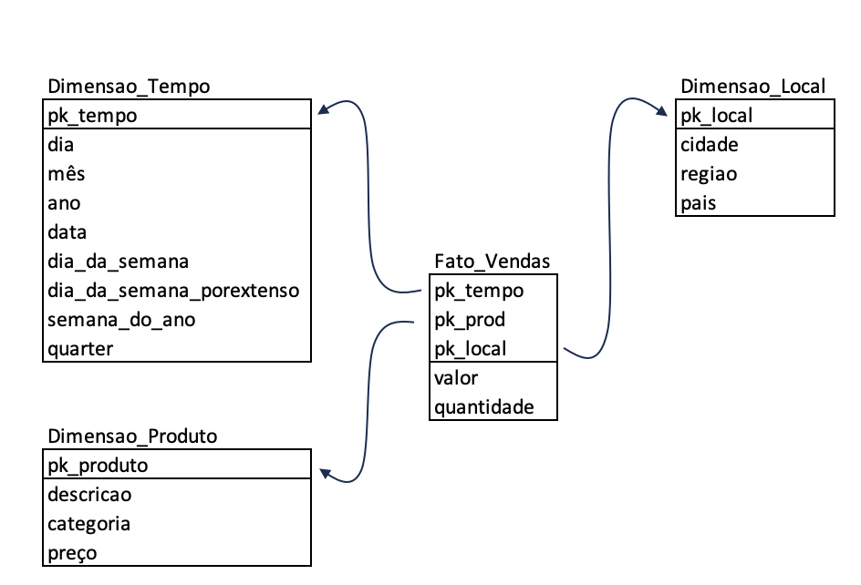

# Data-Warehouse

## Resumo do Projeto
O principal objetivo deste projeto é estudar e treinar a aplicação de um Data Warehouse, usando técnicas de modelagem dimensional. O modelo escolhido para o projeto foi o modelo estrela, que consiste numa mistura de modelagem conceitual com
modelagem lógica, distinguindo melhor as dimensões e simplificando a visualização dimensional.

## Fonte dos dados

A fonte de dados usado para essa prática é o Northwind.

O Northwind é um banco de dados de exemplo amplamente utilizado para demonstração e aprendizado de conceitos de bancos de dados relacionais. Criado pela Microsoft, o Northwind representa uma empresa fictícia de comércio que vende produtos alimentícios e outros itens para clientes em todo o mundo.
O banco de dados contém várias tabelas, incluindo informações sobre clientes, fornecedores, funcionários, pedidos, produtos e categorias de produtos. Além disso, o Northwind inclui relacionamentos entre essas tabelas, como clientes fazendo pedidos, produtos pertencendo a categorias, e pedidos sendo processados por funcionários.

## Esquema do Banco de Dados Northwind

## Objetivo Proposto

O objetivo desta prática é realizar uma análise detalhada das vendas da empresa, considerando variáveis como local de venda, data da transação, tipo de produto, quantidade de itens vendidos e preço de cada venda. O intuito é fornecer insights valiosos para a tomada de decisões estratégicas, permitindo uma compreensão mais aprofundada dos padrões de consumo e do desempenho comercial.

## Modelo de DW 

## Implementação

Com o modelo proposto, serão realizadas diversas queries, que serão responsáveis por implementar efetivamente o modelo dado. As mesmas se encontram na pasta 'SQL queries' separadas de acordo com cada ação realizada.

